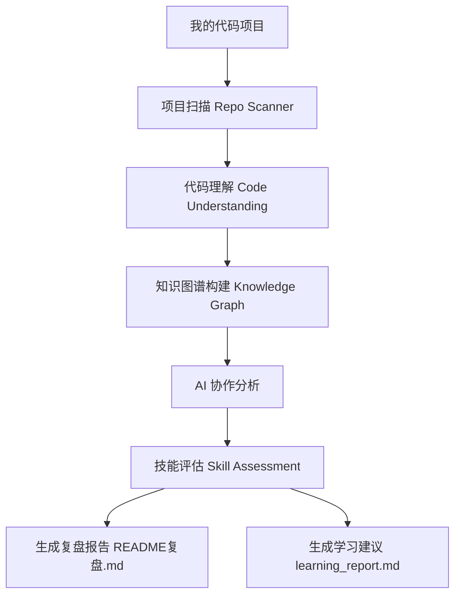
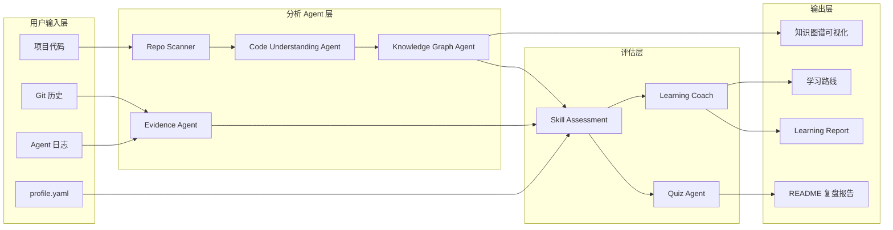

# RepoCourse · AI 时代的项目学习复盘助手

> 让 AI 辅助编程时代，每一次「完成项目」都变成「理解项目」。

## 为什么需要它

AI 让完成项目越来越快，但也带来三个新问题：

- ❓ **不知道自己真正学会了什么** —— 项目跑通了，知识未必进了脑子
- 🤖 **不清楚哪些部分依赖 AI** —— 哪些代码是 AI 写的，哪些是你自己设计的
- 🧭 **不知道下一步应该学什么** —— 缺少个性化的学习反馈

RepoCourse 通过四个环节解决这些问题：

1. 🔍 **项目代码分析** —— 扫描项目结构、技术栈与核心代码
2. 🤝 **AI 协作分析** —— 基于 Git / Agent 日志等证据，复盘你与 AI 的分工（非作弊检测）
3. 🎯 **技能评估** —— 技能档案 × 项目证据 × Quiz × AI 贡献，评估真实掌握程度
4. 📈 **学习反馈** —— 学习盲区、游戏技能树、下一步学习计划

输入一个代码项目，即可得到**双报告**（技术复盘《README复盘.md》＋个人成长反馈
《learning_report.md》）、**知识图谱**（Obsidian 可视化）与**个性化学习计划**。

## 核心能力

### 1. 项目理解

RepoCourse 自动分析代码仓库，帮助开发者快速理解：

- 项目结构
- 技术栈
- 核心代码逻辑

**对应技术**：Repo Scanner · Code Understanding Agent

---

### 2. AI 协作分析

分析开发过程中 AI 的参与方式，包括：

- AI 生成代码
- AI 辅助修改
- Debug 帮助
- 思路讨论

帮助用户了解：自己是如何与 AI 共同完成项目的。

**对应技术**：Evidence 分析 · Agent 日志解析

---

### 3. 技能评估

结合项目实际使用技术、profile.yaml 技能档案与 Quiz 验证结果，判断：

- 用户真正掌握了什么
- 哪些能力需要提升

**对应技术**：Skill Assessment · Knowledge Graph

---

### 4. 学习反馈

根据项目分析结果生成：

- 学习盲区
- 面试问题
- 下一步练习建议

帮助开发者从「完成项目」走向「理解项目并提升能力」。

**对应技术**：Quiz Agent · Learning Coach Agent

## 工作流程

输入一个项目，一次复盘走完以下链路：



## 输出示例

运行：

```bash
apr review .
```

一次复盘生成以下产物：

```text
你的项目/
├── output/
│   ├── README复盘.md         # 技术复盘：8 大板块 + 技能评估 + 学习路线 + 证据附录
│   └── learning_report.md    # 学习成长反馈：学到什么 / AI 协作 / 盲区 / 学习路线
├── knowledge_graph.*         # 知识图谱：json/html/canvas/mindmap + 学习技能树
└── learning_plan.json        # 个性化学习计划（apr plan）
```

### 技术复盘《README复盘.md》节选

```markdown
## AI 协作分析

| AI 代码生成 | AI 辅助修改 | 人工设计 |
| --- | --- | --- |
| 0% | 10% | 90% |

**AI 主要用于**：

- ✓ 代码生成（3 个文件由 AI 主导或辅助）

**你的优势**：

- 能够修改和整合 AI 代码
```

### 学习成长报告《learning_report.md》节选

```markdown
## 4. 我的学习盲区

### REST API

为什么：
- 项目使用REST API
- 用户没有相关经验
- 暂无 Quiz 验证
- 代码以人工编写为主
```

> 完整示例见本仓库 output/ 目录——对 RepoCourse 自身复盘的真实产物。

## 安装

    pip install -e .

或不用安装，直接运行：

    python -m apr review .

## 快速开始

1. 在目标项目根目录初始化配置：

       apr init

2. 设置 API Key（以 DeepSeek 为例）：

       set DEEPSEEK_API_KEY=sk-xxx        （Windows）
       export DEEPSEEK_API_KEY=sk-xxx     （macOS/Linux）

3. 编辑 profile.yaml，填写技能档案（支持新版结构：skills/mastered/learning/target
   带等级与主题，也兼容旧版扁平格式）。
4. 生成复盘报告：

       apr review .

   生成两份报告（位于项目根目录 output/ 下）：
   - output/README复盘.md —— 技术复盘（面向开发者/面试）
   - output/learning_report.md —— 学习成长反馈（面向学习者：学到了什么/AI 协作/盲区/学习路线）

## 报告结构

| # | 板块 | 数据来源 |
|---|------|---------|
| 1 | 项目介绍 | 项目画像 |
| 2 | 技术栈 | 清单文件检测（package.json / requirements.txt / pyproject.toml / go.mod / Cargo.toml / pom.xml …）|
| 3 | 项目结构 | 目录树 + LLM 分析 |
| 4 | 核心代码分析 | 关键文件摘录 + LLM |
| 5 | AI 协作分析 | **证据引擎计算**（参与比例/AI 用途/你的参与/优势与建议，非作弊检测）|
| 6 | 我的学习盲区 | **证据引擎计算**（项目需求×档案×Quiz×AI贡献×知识图谱，非 AI 猜测）|
| 7 | 面试问题 | 项目画像 + LLM |
| 8 | 下一步练习 | 以上全部 |
| 9 | 我的技能评估 | 技能档案 + 项目证据 + Quiz + 置信度 |
| 10 | 下一阶段学习路线 | **Learning Coach**（原因/学习任务/实践项目）|
| 附录A | AI 生成证据明细 | 逐文件证据表 |
| 附录B | 实践验证记录 | 问答得分 |

## 证据体系

「AI 生成部分」采用多源证据融合，按权重合并为文件级「AI 贡献度」：

| 证据源 | 权重 | 说明 |
|-------|------|------|
| 代码标记 | 1.0 | # AI-GENERATED: … / # HAND-WRITTEN 等注释 |
| Agent 日志 | 0.9 | Claude Code 工具调用（Edit/Write）；手动导入；DSH（统一事件系统）/ Cursor 目录 |
| Git 历史 | 0.8 | 提交作者/邮箱、Co-authored-by、逐文件 AI 提交占比与新增行占比 |
| 变更轨迹 | 0.8 | 由 Agent 编辑事件与 Git numstat 构成 |

判定：AI 贡献度 ≥ 70% 为「AI 主导」，40%~70% 为「AI 辅助」，置信度 < 30% 为「证据不足」。
报告中严格区分「有证据的结论」与「推测」。

### 如何提供 Agent 日志

- **手动导入（通用）**：把任意 Agent 的对话记录（txt/md/log/jsonl）放到
  <项目>/.apr/logs/ 下。
- **Claude Code**：自动解析 ~/.claude/projects/*.jsonl。
- **DSH**：在 apr.yaml 配置 evidence.dsh_logs_dir，经统一事件系统解析。
- **Cursor**：在 apr.yaml 配置 evidence.cursor_logs_dir（通用解析）。

### 如何标记代码

在文件中加入注释即可被识别：

- # AI-GENERATED: 这段由 Claude 编写
- # HAND-WRITTEN（否定标记）

## 知识图谱（apr graph）

    apr graph <项目路径>     # 生成 4 个文件：
    knowledge_graph.json          # 标准图数据（节点/关系）
    knowledge_graph.html          # Obsidian 关系图谱风格可视化（拖拽/缩放/悬停高亮）
    knowledge_graph.canvas        # Obsidian Canvas 四列分层画布（拖入 Vault 即用）
    knowledge_graph-mindmap.md    # Mermaid 思维导图（Obsidian 原生渲染）

图谱四层：文件 ─uses→ 技术 ─covers→ 知识点 ─assesses→ 用户技能（掌握程度 %）。
文件节点带 AI 贡献徽标，技术节点带平均 AI 贡献——一眼看出哪些是「纸面掌握」。

## 学习计划（apr plan）

    apr plan <项目路径>     # 不调用 LLM，几秒出计划；保存 learning_plan.json

由 Learning Coach 生成：优先级（skill/level/reason/action）＋ 下一步实践项目。

## 命令

    apr review <项目路径>        # 生成复盘报告（默认 README复盘.md）
    apr scan <项目路径>          # 只扫描并预览技术栈，不调用 LLM
    apr graph <项目路径>         # 生成知识图谱（json/html/canvas/mindmap）
    apr plan <项目路径>          # 生成个性化学习计划 learning_plan.json
    apr quiz <项目路径>          # 只运行实践验证问答
    apr init <项目路径>          # 生成 apr.yaml 与 profile.yaml 模板
    apr web                      # 启动 Web 界面（http://127.0.0.1:8765）
    apr config                   # 交互向导：切换 LLM 供应商/模型
    apr config show              # 查看当前生效配置
    apr config set --preset deepseek-flash   # 一键切换预设（写全局）
    apr config set --preset deepseek-flash --local   # 只写当前项目

常用参数：--provider mock（离线演示）、--skip-quiz、--no-cache、--output 路径、
--language en、--dry-run、-v。

### Web 界面

    apr web --port 8765 --open

零第三方依赖（stdlib http.server），功能：输入项目路径 → 项目预览 → 一键复盘 →
实时进度日志 → 报告预览与下载。Web 端默认跳过交互问答（答题升级为学习评估系统
属 Phase 4）。

## 切换模型（apr config）

    apr config set --preset deepseek-pro     # DeepSeek V4 Pro（默认）
    apr config set --preset deepseek-flash   # DeepSeek V4 Flash（更便宜）
    apr config set --preset openai-mini      # OpenAI GPT-4o-mini
    apr config set --preset ollama-qwen      # 本地 Ollama
    apr config set --model deepseek-v4-flash # 只改模型，其余不变
    apr config                               # 交互式向导

默认写入全局 ~/.apr/apr.yaml（所有项目生效）；加 --local 只写当前项目 apr.yaml。
配置优先级：命令行参数 > 环境变量 > 项目 apr.yaml > 全局 ~/.apr/apr.yaml > 内置默认。

## 配置

项目根目录 apr.yaml（可用 apr init 生成），环境变量可覆盖：
APR_PROVIDER、APR_MODEL、APR_BASE_URL、APR_API_KEY。

## 技术架构

RepoCourse 采用多 Agent 协作架构，数据从输入层逐层流向输出层：



**用户输入层**

- 项目代码仓库
- Git 历史
- Agent 日志
- profile.yaml（技能档案）

**分析 Agent 层**

- **Repo Scanner** —— 负责：项目扫描、技术栈识别
- **Code Understanding Agent** —— 负责：代码结构理解、核心逻辑分析
- **Knowledge Graph Agent** —— 负责：建立项目知识关系
- **Evidence Agent** —— 负责：分析 AI 参与证据

**评估层**

- **Skill Assessment** —— 负责：结合项目需求和用户能力评估
- **Quiz Agent** —— 负责：实践验证
- **Learning Coach** —— 负责：生成学习建议

**输出层**

- README 复盘报告
- Learning Report
- Knowledge Graph（JSON / HTML / Obsidian Canvas / 技能树）
- 学习路线（learning_plan.json）


## 项目状态

| 模块 | 状态 |
|---|---|
| 项目扫描 | ✅ 已完成 |
| 代码理解 | ✅ 已完成 |
| AI 协作分析 | ✅ 已完成 |
| 技能评估 | ✅ 已完成 |
| Quiz 验证 | ✅ 已完成 |
| Knowledge Graph | ✅ 已完成 |
| 学习反馈 | 🚧 持续优化 |
| Web Dashboard | 📌 计划中 |

## Roadmap

### Phase 1：项目理解能力

已完成：

- 项目扫描
- 技术栈分析
- 核心代码理解

### Phase 2：AI 协作分析

已完成：

- Agent 日志解析
- Git 证据分析
- AI 参与分析

### Phase 3：个人能力评估

已完成：

- profile.yaml 技能档案
- Skill Assessment
- Quiz 验证

### Phase 4：学习体验优化

进行中：

- 更友好的学习报告
- 知识图谱优化
- 个性化学习建议

### Phase 5：未来方向

计划（探索中）：

- 多项目成长追踪
- Web Dashboard
- 更丰富的可视化
- 项目之间的能力关联


## 开发与同步

本仓库配置了 post-commit 自动推送钩子（.githooks/post-commit，经 core.hooksPath 启用）：
每次 git commit 成功后自动推送 GitHub。在新克隆的仓库中执行
git config core.hooksPath .githooks 即可启用。

## 免责声明

报告由 AI 自动生成，仅供学习复盘参考；标注「推测」的内容未经证据证实。
