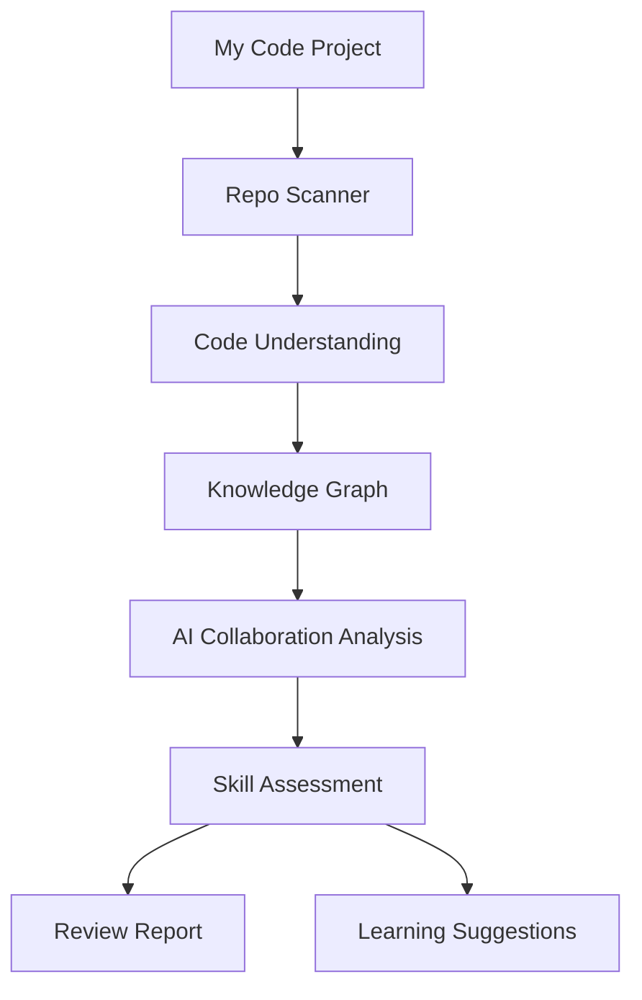
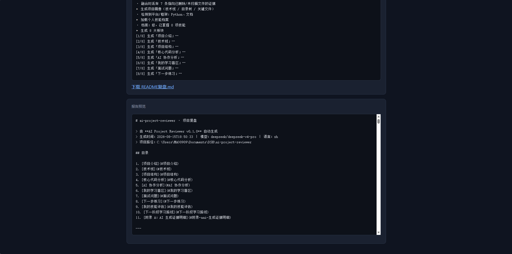
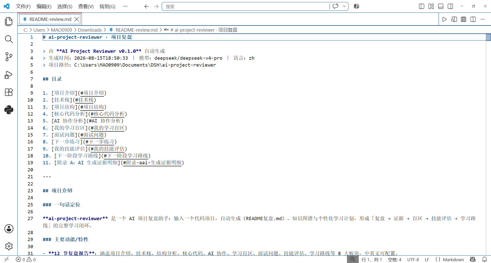
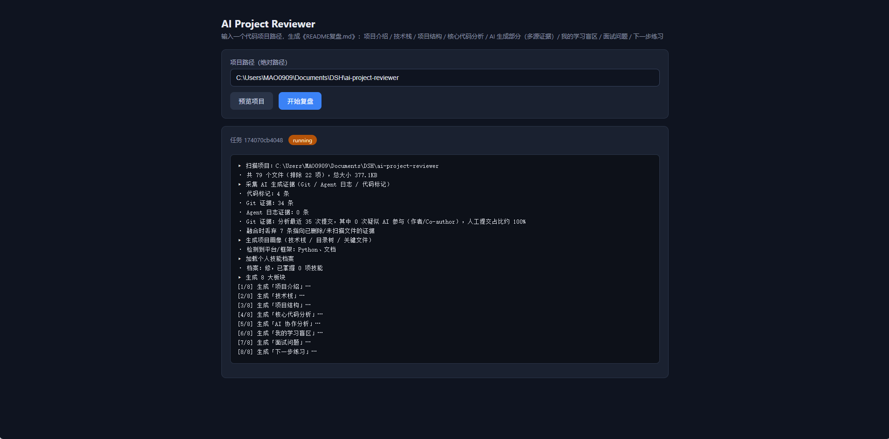
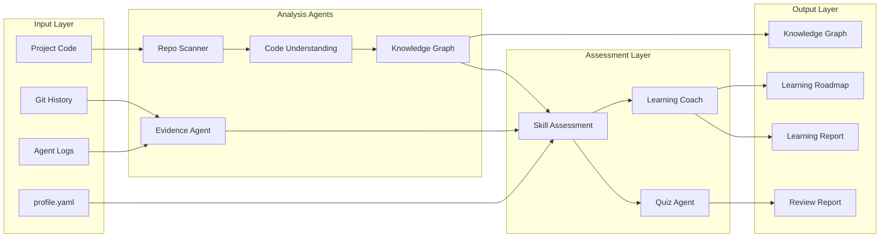

# RepoCourse · Project Learning Review Assistant for the AI Era

[中文](README.md) | English


> In the AI-assisted coding era, turn every "project done" into "project understood".

## Why RepoCourse

AI makes finishing projects faster than ever, but it creates three new problems:

- ❓ **You do not know what you actually learned** — the code runs, but the knowledge may not be in your head
- 🤖 **You are not sure which parts depend on AI** — which code was written by AI, which was designed by you
- 🧭 **You do not know what to learn next** — no personalized learning feedback

RepoCourse solves these with four stages:

1. 🔍 **Project Understanding** — scan structure, tech stack and core code
2. 🤝 **AI Collaboration Analysis** — review how you and AI worked together (evidence-based, not cheat detection)
3. 🎯 **Skill Assessment** — profile × project evidence × Quiz × AI contribution
4. 📈 **Learning Feedback** — blind spots, skill tree, next-step learning plan

Feed it a code project and get **two reports** (technical review + personal growth feedback), a **knowledge graph** (with Obsidian visualizations) and a **personalized learning plan**.

## Core Capabilities

### 1. Project Understanding

RepoCourse analyzes your repository and helps you quickly understand:

- Project structure
- Tech stack
- Core code logic

**Backed by**: Repo Scanner · Code Understanding Agent

---

### 2. AI Collaboration Analysis

Analyzes how AI participated during development:

- AI-generated code
- AI-assisted modifications
- Debug help
- Design discussions

Helps you understand how you and AI completed the project together.

**Backed by**: Evidence Analysis · Agent Log Parsing

---

### 3. Skill Assessment

Combines the technologies actually used in the project, your profile.yaml and Quiz results to judge:

- What you truly master
- What needs improvement

**Backed by**: Skill Assessment · Knowledge Graph

---

### 4. Learning Feedback

Generates from the analysis results:

- Learning blind spots
- Interview questions
- Next-step practice suggestions

Moving you from "finished the project" to "understood the project and leveled up".

**Backed by**: Quiz Agent · Learning Coach Agent

## How It Works

One review run walks through this pipeline:



## Output Example

Run:

```bash
apr review .
```

```text
your-project/
├── output/
│   ├── README-review.md        # technical review
│   └── learning_report.md      # personal growth feedback
├── knowledge_graph.*           # json/html/canvas/mindmap + skill tree
└── learning_plan.json          # personalized learning plan
```





## Install

```bash
pip install -e .
```

Or run directly without installing:

```bash
python -m apr review .
```

## Quick Start

```bash
apr init                          # create apr.yaml + profile.yaml
set DEEPSEEK_API_KEY=sk-xxx       # Windows (or export on macOS/Linux)
apr review .                      # generate reports
```

## Commands

```text
apr review .     # technical review + learning report → output/
apr scan .       # tech stack preview only (no LLM)
apr graph .      # knowledge graph (json/html/canvas/mindmap/skill-tree)
apr plan .       # learning plan (no LLM) → learning_plan.json
apr quiz .       # AI-generated quiz + grading
apr web          # web UI at http://127.0.0.1:8765
apr config       # switch LLM providers interactively
```

Web UI:



## Architecture

Multi-agent collaboration, four layers:



## Project Status

| Module | Status |
|---|---|
| Project Scanning | ✅ Done |
| Code Understanding | ✅ Done |
| AI Collaboration Analysis | ✅ Done |
| Skill Assessment | ✅ Done |
| Quiz Verification | ✅ Done |
| Knowledge Graph | ✅ Done |
| Learning Feedback | 🚧 Improving |
| Web Dashboard | 📌 Planned |

## Roadmap

- **Phase 1 · Project Understanding** (done): scanning, tech stack, core code understanding
- **Phase 2 · AI Collaboration Analysis** (done): agent logs, Git evidence, AI participation
- **Phase 3 · Skill Assessment** (done): profile.yaml, Skill Assessment, Quiz
- **Phase 4 · Learning Experience** (in progress): friendlier learning report, graph polish, personalized advice
- **Phase 5 · Future** (planned): multi-project growth tracking, Web Dashboard, richer visualizations, cross-project skill correlation

## License

MIT © 2026 xiuxxx0
